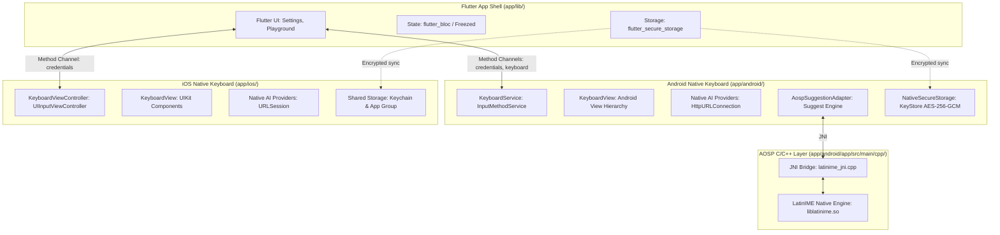

# AI Keyboard — Application Architecture & Development Guide

This document provides a technical overview of the `app/` codebase, detailing the multi-layer architecture, component responsibilities, data flows, and build procedures.

---

## High-Level System Architecture

The application is architected across three primary runtime layers, bridging cross-platform UI with high-performance native keyboard extensions:



---

## 1. Flutter Layer (`app/lib/`)

The Flutter application shell serves as the primary configuration and testing surface.

### Architecture & Design Patterns
- **Clean Architecture:** Domain entities and repositories are decoupled from data providers and presentation logic.
- **State Management:** BLoC pattern using `flutter_bloc`.
- **Dependency Injection:** `get_it` service locator registered via `injectable` code generation.
- **Immutable Models:** Data models built with `freezed` and `json_annotation`.
- **Routing:** Declarative routing configured via `go_router`.
- **Error Handling:** Functional `Result<T, Failure>` pattern using explicit Success/Failure variants.

### Feature Structure
- `features/ai_service/`:
  - `domain/entities/`: `AiModel`, `AiRequest`, `AiResponse`, `AiProviderConfig`.
  - `domain/repositories/`: `AiRepository` interface.
  - `domain/usecases/`: `TransformTextUsecase`.
  - `data/providers/`: HTTP clients for Gemini, OpenAI, Groq, OpenRouter using `Dio`.
  - `data/repositories/`: `AiRepositoryImpl`.
- `features/settings/`:
  - `domain/entities/`: `UserSettings`, `AiProviderType`, `AiProviderMetadata`.
  - `domain/repositories/`: `SettingsRepository`, `CredentialsRepository`.
  - `presentation/bloc/`: `SettingsBloc`, `SettingsEvent`, `SettingsState`.
  - `presentation/pages/`: Provider selection, API key entry, model selection, custom URL configuration.
- `features/commands/`:
  - `domain/entities/`: `CommandEntity`.
  - `domain/parser/`: `CommandParser` for trailing `@` commands.
  - `domain/repositories/`: `CommandRegistry` with prompts and language mappings.
  - `presentation/bloc/`: `CommandBloc`.
- `features/playground/`:
  - Interactive testing sandbox to verify keyboard appearance and text transformations.
- `features/app_shell/`:
  - Navigation shell and responsive UI layout.
- `core/`:
  - Dependency injection (`injection.dart`), theme definitions (`AppTheme`), typography, color palettes, and failure types.

---

## 2. Android Native Layer (`app/android/`)

The Android keyboard is implemented natively in Kotlin and C++ to ensure low-latency keystroke handling, zero runtime overhead during standard typing, and seamless integration with the Android `InputMethodService` framework.

### Key Components
- **`KeyboardService` (`keyboard/KeyboardService.kt`):**
  - Subclasses `android.inputmethodservice.InputMethodService`.
  - Oversees lifecycle callbacks: `onCreate`, `onCreateInputView`, `onStartInput`, `onStartInputView`, `onFinishInputView`, `onFinishInput`, `onDestroy`.
  - Holds reference to the active service instance and delegates logic to `KeyboardController`.
- **`KeyboardController` (`keyboard/KeyboardController.kt`):**
  - Central orchestrator for the keyboard session.
  - Manages `TextEditor`, `AiTextTransformer`, `SuggestionEngine`, `VoiceInputController`, `ClipboardHistoryManager`, `GifProvider`, `RecentGifManager`, `GifInserter`, `KeyboardHeightRepository`, and `NumberRowRepository`.
  - Maintains keyboard state: `KeyboardMode` (`MAIN`, `MORE`, `EMOJI`, `CLIPBOARD`, `GIF`, `STICKERS`, `RESIZE`), `ShiftState` (`LOWERCASE`, `SHIFT_ON`, `CAPS_LOCK`), and active transformation sessions.
- **`KeyboardView` (`ui/KeyboardView.kt`):**
  - Subclasses `android.widget.LinearLayout`.
  - Built with native Android Views (dynamic key layouts, `TextView` key labels, `ImageView` key icons).
  - Integrates `androidx.emoji2.emojipicker.EmojiPickerView` for emoji input.
  - Integrates `RecyclerView` with `GridLayoutManager` for clipboard history and GIF search results.
- **`TextEditor` (`text/TextEditor.kt`):**
  - Wraps the active `InputConnection` to perform text extraction before/after cursor, text commits, backspace operations, and text replacements.
- **`NativeCommandRegistry` & `CommandParser` (`command/`):**
  - Recognizes trailing `@` commands (`@fix`, `@rewrite`, `@pro`, `@casual`, `@short`, `@expand`, `@translate:<lang>`).
  - Supplies verified system prompts and status indicators.
- **Native AI Pipeline (`ai/`):**
  - Provider implementations: `GeminiProvider`, `OpenAiProvider`, `GroqProvider`, `OpenRouterProvider`.
  - Executes direct HTTPS calls via `java.net.HttpURLConnection` inside coroutines (`Dispatchers.IO`).
  - Completely independent of the Flutter runtime during active keyboard operation.
- **Secure Storage (`config/NativeSecureStorage.kt`):**
  - Hardware-backed Android KeyStore AES-256-GCM encryption for stored API keys.
  - Key alias: `AiKeyboardKeyStoreKey` in `AndroidKeyStore`.
  - Encrypted values stored in private preferences (`ai_keyboard_secure_prefs`).

---

## 3. AOSP C/C++ Layer (`app/android/app/src/main/cpp/`)

Provides native dictionary lookup, Patricia trie traversal, and word prediction.

- **`aosp_latinime/src/`:**
  - Direct import of AOSP LatinIME C++ source code (Apache 2.0).
  - Trie structures (`v2`, `v4`), bigram models, character proximity tables, and scoring policies.
- **`latinime/`:**
  - JNI bridge layer (`latinime_jni.cpp`).
  - Defines native entry points: `openNative`, `isValidWordNative`, `getSuggestionsNative`, `closeNative`.
- **`CMakeLists.txt`:**
  - Compiles `liblatinime.so` targeting C++17 with strict optimization flags.
- **Dictionary Asset:**
  - Bundled binary dictionary `main_en.dict` located in `app/android/app/src/main/assets/dictionaries/` (~1.07MB, header magic `0x9BC13AFE`).

---

## 4. iOS Native Layer (`app/ios/`)

The iOS implementation provides a native keyboard extension built in Swift using UIKit.

- **`KeyboardViewController` (`KeyboardExtension/KeyboardViewController.swift`):**
  - Subclasses `UIInputViewController`.
- **`KeyboardView` (`KeyboardExtension/KeyboardView.swift`):**
  - Built with UIKit components (`UIView`, `UIStackView`, `KeyboardKeyButton`, `UILabel`, `UIScrollView`).
  - Implements QWERTY layout, symbols view, and status bar.
- **`KeyboardController` (`KeyboardExtension/KeyboardController.swift`):**
  - Manages typing state, shift/caps lock cycles, and `@` command dispatching.
- **`TextDocumentEditor` (`KeyboardExtension/TextDocumentEditor.swift`):**
  - Manipulates text via `UITextDocumentProxy`.
- **Native AI Pipeline (`KeyboardExtension/AI/`):**
  - Lightweight Swift implementations of Gemini, OpenAI, Groq, and OpenRouter using `URLSession`.
- **Shared Code (`Shared/`):**
  - `KeychainCredentialStore.swift`: Stores API keys in the iOS Keychain under service `com.pk.ai_keyboard.apiKey`.
  - `SharedConfigurationStore.swift`: Synchronizes non-secret preferences via App Group `group.com.pk.ai_keyboard.shared`.

---

## 5. Platform Communication Channels

Inter-process communication between the Flutter app shell and the native host is handled via Flutter `MethodChannel`:

### Android Method Channels
1. **`com.pk.ai_keyboard/credentials` (`MainActivity.kt`):**
   - `saveApiKey(provider, apiKey)`: Encrypts and persists key in Android KeyStore.
   - `getApiKey(provider)`: Retrieves decrypted API key.
   - `deleteApiKey(provider)`: Removes API key.
   - `hasApiKey(provider)`: Checks key existence.
   - `saveConfig(provider, modelId, baseUrl)`: Saves active provider settings.
   - `saveDisabledCommands(disabledTriggers)`: Persists user-disabled command triggers.
2. **`com.pk.ai_keyboard/keyboard` (`MainActivity.kt`):**
   - `isAiKeyboardActive`: Verifies if AI Keyboard is currently the default system IME.
   - `openKeyboardSettings`: Launches system input method settings intent.
   - `getKeyboardHeight` / `setKeyboardHeight` / `resetKeyboardHeight`: Manages custom keyboard height.
   - `getUseNumbers` / `setUseNumbers`: Controls number row visibility.

### iOS Method Channel
1. **`com.pk.ai_keyboard/credentials` (`AppDelegate.swift`):**
   - `saveApiKey`, `getApiKey`, `deleteApiKey`, `hasApiKey`, `saveConfig`, `saveDisabledCommands`.
   - Reads/writes to iOS Keychain and App Group `UserDefaults`.

---

## 6. End-to-End Execution Flows

### AI Text Transformation Flow
```text
User types: "We should meet tomorrow @pro"
                    │
                    ▼
       InputConnection / DocumentProxy
                    │
                    ▼
             CommandParser
   • Detects trailing '@pro' token
   • Validates non-empty preceding text: "We should meet tomorrow"
   • Fetches system prompt from CommandRegistry
                    │
                    ▼
           AiTextTransformer
   • Retrieves active provider and decrypted API key from SecureStorage
   • Formats payload: { prompt, text, temperature: 0.0, max_tokens: 1024 }
                    │
                    ▼
    Native HTTP Client (HttpURLConnection / URLSession)
   • Sends HTTPS POST to selected provider endpoint
                    │
                    ▼
           Provider Response
   • Extracts transformed text
                    │
                    ▼
              TextEditor
   • Deletes input characters before cursor (full match length)
   • Commits transformed text: "I recommend we schedule a meeting tomorrow."
```

### Word Suggestion Flow (Android)
```text
User taps letter key (e.g. 'h' -> 'e' -> 'l')
                    │
                    ▼
              WordComposer
   • Appends code point to current word composition
                    │
                    ▼
          AospSuggestionAdapter
   • Obtains current NgramContext from preceding text
   • Obtains keyboard geometry from KeyboardGeometryBuilder
                    │
                    ▼
                 Suggest
                    │
                    ▼
        DictionaryFacilitatorImpl
                    │
                    ▼
            BinaryDictionary
   • Calls NativeBinaryDictionary.getSuggestionsNative() via JNI
   • Native liblatinime traverses Patricia trie using ProximityInfo
                    │
                    ▼
       Native Suggestion Candidates
   • Returns ordered suggestions with confidence scores
                    │
                    ▼
          KeyboardView (UI)
   • Renders suggestions in the candidate suggestion bar
```

---

## 7. Developer Workflows

### Setup
```bash
git clone https://github.com/pavan-marthala/ai_keyboard.git
cd ai_keyboard/app
flutter pub get
```

### Code Generation
Whenever entities, Freezed models, or Injectable modules are updated:
```bash
dart run build_runner build --delete-conflicting-outputs
```

### Testing
```bash
# Run Flutter tests
flutter test

# Run Android native tests
cd android && ./gradlew test
```

### Building
```bash
# Debug APK
flutter build apk --debug

# Release APK (requires signing config)
flutter build apk --release

# iOS (requires Xcode)
flutter build ios
```
