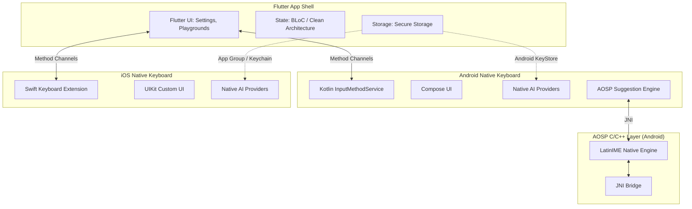

# AI Keyboard - App Architecture & Development Guide

This document outlines the architecture, layer responsibilities, and development workflows for the AI Keyboard application.

## High-Level Architecture

The project is structured into three main layers, communicating across boundaries to provide a seamless user experience between the configuration app and the native custom keyboards.



---

## 1. Flutter Layer (`app/lib/`)

The Flutter layer acts as the configuration shell. It is responsible for the Settings UI, AI service configuration, provider management, and the keyboard testing playground.

- **State Management**: Uses the BLoC pattern (`flutter_bloc`).
- **Dependency Injection**: Uses `get_it` and `injectable` (via code generation).
- **Architecture**: Feature-based clean architecture:
  - `features/ai_service/`: Abstract provider and repository patterns.
    - `data/providers/`: Implementations for Gemini, OpenAI, Groq, OpenRouter.
    - `domain/entities/`: Domain models like `AiModel`, `AiRequest`, `AiProviderConfig` (using Freezed).
    - `domain/repositories/`: `AiRepository` interface.
    - `domain/usecases/`: `TransformTextUsecase`.
  - `features/settings/`: Manages provider configs and credentials (stored securely via `flutter_secure_storage`). Powered by `SettingsBloc`.
  - `features/commands/`: Slash command parsing (`/fix`, `/translate`, etc.). Managed by `CommandBloc`.
  - `features/playground/`: UI for testing the keyboard.
  - `features/app_shell/`: App navigation handled by `go_router`.
- **Core (`core/`)**: Dependency injection setup, error handling (`Result` type), themes, and utilities.

## 2. Android Native Layer (`app/android/app/src/main/kotlin/`)

The Android keyboard is built natively to ensure high performance and seamless integration with the OS.

- **Core Service**:
  - `keyboard/KeyboardService.kt` - The `InputMethodService` entry point.
  - `keyboard/KeyboardController.kt` - Manages key event handling and mode switching.
- **UI**:
  - `ui/KeyboardView.kt` - Built entirely with Jetpack Compose (~87KB, full keyboard rendering).
- **AI Integration (`ai/`)**:
  - Native implementations for AI providers (Gemini, OpenAI, Groq, OpenRouter).
  - Uses `HttpURLConnection` directly (no Retrofit/OkHttp to minimize dependencies).
  - Includes `AiProviderFactory`, `AiProvider` interface, and `AiResult` sealed class.
- **Text & Transformation**:
  - `transform/AiTextTransformer` handles text processing.
  - `text/TextEditor.kt` manages text manipulation via `InputConnection`.
  - `command/` handles native command parsing and registry.
- **AOSP Suggestion Engine (`suggestion/`)**:
  - `AospSuggestionEngine.kt` initializes dictionaries.
  - `aosp/` contains AOSP-derived classes (19 files with Apache 2.0 headers) for dictionary facilitation, word composition, and suggestions.
- **Configuration & Storage**:
  - `config/NativeSecureStorage.kt` uses Android KeyStore AES-256-GCM encryption.
  - `config/AiConfiguration.kt` uses SharedPreferences for non-secret configs.
- **Extras**: Modules for clipboard history management (`clipboard/`), Giphy integration (`gif/`), and voice input (`voice/`).

## 3. AOSP C/C++ Layer (`app/android/app/src/main/cpp/`)

Provides the core logic for text prediction and dictionary management for Android.

- **`aosp_latinime/`**: The core AOSP LatinIME native library.
  - Handles Dictionary structures (v2, v4, backward/v402).
  - Suggest engine components (DicNode, ProximityInfo, Weighting).
  - Utility functions (char_utils, format_utils, probability_utils).
- **`latinime/`**: JNI bridge layer.
  - `latinime_jni.cpp` serves as JNI entry points.
  - Interfaces for dictionary facades, tries, suggestion decoding, and buffers.
- **Build System**: Managed via CMake (`CMakeLists.txt`).

## 4. iOS Native Layer (`app/ios/`)

The iOS keyboard is a standard Custom Keyboard Extension built with Swift and UIKit.

- **Host App**: `Runner/AppDelegate.swift` handles the Flutter host and platform channels for credential syncing.
- **Keyboard Extension (`KeyboardExtension/`)**:
  - `KeyboardViewController.swift` (`UIInputViewController` subclass).
  - `KeyboardView.swift`, `KeyboardKeyButton.swift`, `KeyboardController.swift`, `KeyboardTheme.swift` manage UI and interactions using UIKit.
  - `CommandParser.swift` handles slash commands.
  - `TextDocumentEditor.swift` manipulates the text proxy.
  - `KeyboardConfigurationReader.swift` reads configuration from the App Group.
  - `AI/` contains native AI provider implementations.
- **Shared Code (`Shared/`)**:
  - `KeychainCredentialStore.swift` wraps iOS Keychain operations.
  - `SharedConfigurationStore.swift` uses UserDefaults via App Group.
  - `SharedConstants.swift`.

---

## Inter-Process & Platform Communication

- **Flutter ↔ Android**: Uses standard Method Channels for keyboard status checks and settings synchronization.
- **Flutter ↔ iOS**: Method Channels handle credential management (`saveApiKey`, `getApiKey`, `deleteApiKey`, `hasApiKey`).
- **iOS App ↔ Extension**:
  - **App Group**: Shared `UserDefaults` passes configuration between the main app and keyboard extension.
  - **Keychain**: Shared access group ensures both the app and extension can securely read/write API credentials.

---

## Core Data Flows

### AI Transformation Flow

1. User types text and invokes a command (e.g., `/fix`).
2. Native keyboard parses the command and identifies the target provider and model.
3. Native keyboard reads the required API key from local secure storage (Android KeyStore / iOS Keychain).
4. Native AI provider fires a direct HTTP request to the provider's API.
5. The received response text directly replaces the user's input in the current text field.

### Dictionary / Suggestion Flow (Android Only)

1. `KeyboardService` initializes the `AospSuggestionEngine` upon startup.
2. The engine loads the `main_en.dict` binary dictionary via `DictionaryFactory`.
3. On every keypress, `WordComposer` builds the current composition state.
4. `Suggest.getSuggestions()` invokes the native LatinIME algorithm via JNI.
5. Results are returned as a list of `SuggestionCandidate`s to `KeyboardView` for rendering.

---

## Development Guide

### Code Generation (Flutter)

This project heavily relies on code generation for Dependency Injection (injectable), Data classes (Freezed), and JSON serialization.

Whenever you change a data model or a DI configuration, you must run the build runner:

```bash
cd app
dart run build_runner build --delete-conflicting-outputs
```

This command will update the following generated files:
- `*.freezed.dart`
- `*.g.dart`
- `injection.config.dart`

> **Note**: Avoid modifying generated files manually. Always update the source Dart files and re-run the build runner.
