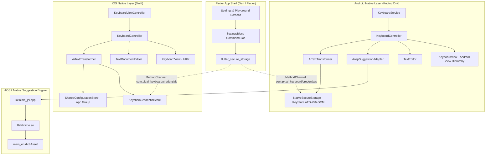

# Architecture Specification

This document defines the complete architecture of the AI Keyboard system, detailing runtime components, class hierarchies, inter-process communication, and third-party integrations across Flutter, Android, and iOS.

---

## 1. Architectural Principles & High-Level View

The AI Keyboard system isolates configuration management from active keyboard execution:

1. **Decoupled Keyboard Runtime:** The native keyboard extensions (Android and iOS) run independently of the Flutter runtime during active typing sessions. Keystroke handling, AOSP dictionary lookup, and AI API dispatching occur natively without invoking Dart isolate execution.
2. **Secure Credential Partitioning:** Sensitive user credentials (AI provider API keys) are stored in platform hardware security modules (Android KeyStore and iOS Keychain). Flutter writes these credentials through native method channels, and the native keyboards read and decrypt them directly.
3. **Single Source of Truth for Commands:** Trailing `@` commands are evaluated uniformly across platforms using dedicated parsers adhering to the same contract.



---

## 2. Flutter Layer Architecture (`app/lib/`)

The Flutter application serves as the user-facing configuration, account management, and test harness shell.

### Technology Stack

- **Framework:** Flutter 3.13+ / Dart SDK `^3.13.2`.
- **State Management:** BLoC pattern using `package:flutter_bloc` (v9.1.1).
- **Code Generation & Models:** `package:freezed_annotation`, `package:json_annotation` powered by `build_runner`.
- **Dependency Injection:** `package:get_it` service locator configured with `package:injectable`.
- **HTTP Client:** `package:dio` (v5.11.0).
- **Secure Persistence:** `package:flutter_secure_storage` (v11.0.0).
- **Navigation:** `package:go_router` (v18.0.0).
- **Local Database:** `package:drift` (v2.34.3) with SQLite.

### Directory Structure & Responsibilities

```text
app/lib/
├── core/
│   ├── di/                 # injection.dart, register_module.dart, injection.config.dart
│   ├── errors/             # failures.dart, result.dart (Result<T, Failure>)
│   ├── theme/              # app_colors.dart, app_theme.dart, app_typography.dart
│   └── utils/              # app_button.dart, app_text_field.dart, app_toast.dart
├── features/
│   ├── ai_service/         # AI provider contracts, repository, and HTTP clients
│   │   ├── data/providers/ # gemini_provider.dart, openai_provider.dart, etc.
│   │   ├── domain/entities/# ai_model.dart, ai_request.dart, ai_response.dart
│   │   └── domain/usecases/# transform_text_usecase.dart
│   ├── app_shell/          # App navigation bar and responsive scaffold
│   ├── commands/           # Command parser, registry, and state management
│   │   ├── domain/parser/  # command_parser.dart
│   │   └── presentation/   # command_bloc.dart
│   ├── playground/         # In-app sandbox for testing keyboard & AI prompt execution
│   └── settings/           # User configuration, provider choice, and credential persistence
│       ├── domain/         # user_settings.dart, ai_provider_type.dart, credentials_repository.dart
│       └── presentation/   # settings_bloc.dart, settings_page.dart
└── main.dart               # Entry point, dependency initialization, global error boundary
```

---

## 3. Android Native Architecture (`app/android/`)

The Android keyboard operates as a system input method using Android's `InputMethodService` framework.

### Component Breakdown & Execution Flow

```text
Android System
     │
     ▼
KeyboardService (InputMethodService)
     │
     ├─► Creates and manages KeyboardController
     ├─► In onCreateInputView(), inflates KeyboardView
     └─► Delegates lifecycle events: onStartInput, onStartInputView, onFinishInput
               │
               ▼
       KeyboardController
               │
               ├─► TextEditor: Reads & writes via InputConnection
               ├─► KeyboardView: Renders Android View hierarchy & handles touch
               ├─► AospSuggestionAdapter: Computes real-time word suggestions
               ├─► AiTextTransformer: Evaluates @ commands & executes transformations
               ├─► VoiceInputController: Manages SpeechRecognizer & dictation state
               ├─► ClipboardHistoryManager: Manages system clipboard monitor & storage
               ├─► GiphyGifProvider / GifInserter: Queries & inserts animated GIFs
               ├─► NumberRowRepository: Persists and toggles the top number row
               └─► KeyboardHeightRepository: Adjusts keyboard vertical height in dp
```

### Class Roles

1. **`KeyboardService.kt`:**
   - Entry point for the Android Input Method Engine (IME).
   - Manages input views and window tokens.
   - Holds reference to `activeInstance` for dynamic preference updates (e.g. number row toggling).
2. **`KeyboardController.kt`:**
   - Handles key dispatching, shift transitions (`LOWERCASE`, `SHIFT_ON`, `CAPS_LOCK`), double-tap shift detection (300ms threshold), and mode switching (`MAIN`, `MORE`, `EMOJI`, `CLIPBOARD`, `GIF`, `STICKERS`, `RESIZE`).
   - Limits transformation input to `MAX_TRANSFORMATION_CHARS = 4000` characters.
3. **`KeyboardView.kt`:**
   - Subclasses `android.widget.LinearLayout`.
   - Constructs UI using native Android Views (no Jetpack Compose).
   - Embeds `androidx.emoji2.emojipicker.EmojiPickerView` for full emoji selection.
   - Embeds `androidx.recyclerview.widget.RecyclerView` for clipboard and GIF search display.
4. **`TextEditor.kt`:**
   - Interacts with `android.view.inputmethod.InputConnection`.
   - Implements safe cursor reads (`getTextBeforeCursor`, `getTextAfterCursor`), text deletion (`deleteSurroundingText`), and text insertion (`commitText`).
5. **`NativeSecureStorage.kt`:**
   - Key storage: Generates an AES-256 key in `AndroidKeyStore` (`AiKeyboardKeyStoreKey`).
   - Cipher: `AES/GCM/NoPadding` with 128-bit authentication tag.
   - Prepends IV bytes to ciphertext and Base64 encodes into `ai_keyboard_secure_prefs`.

---

## 4. AOSP Suggestion Engine Architecture

The text suggestion pipeline is derived from the open-source LatinIME engine developed by the Android Open Source Project (AOSP), licensed under Apache 2.0.

### AOSP Components

- **Origin:** Android Open Source Project LatinIME (`packages/inputmethods/LatinIME`, Copyright 2010–2014 The Android Open Source Project).
- **C++ Engine:** Source located in `app/android/app/src/main/cpp/aosp_latinime/src/` and `app/android/app/src/main/cpp/latinime/`.
- **Build Configuration:** Configured via `app/android/app/src/main/cpp/CMakeLists.txt` compiling into `liblatinime.so` targeting C++17.
- **JNI Interface:** `latinime_jni.cpp` provides native bindings:
  - `openNative(path, offset, length)`: Memory-maps or opens dictionary buffers.
  - `isValidWordNative(dictPtr, word)`: Checks dictionary word presence.
  - `getSuggestionsNative(dictPtr, proximityPtr, input, prevWord, touchXs, touchYs)`: Queries candidates based on input and key proximity.
  - `closeNative(dictPtr)`: Releases allocated native memory structures.

### Runtime Integration Path

```text
KeyboardController
     │
     ▼
AospSuggestionAdapter (implements SuggestionEngine)
     │
     ▼
Suggest
     │
     ▼
DictionaryFacilitatorImpl
     │
     ▼
BinaryDictionary
     │
     ├─► Extracts main_en.dict asset to context.cacheDir
     ├─► Invokes NativeBinaryDictionary.openNative(cachedFilePath)
     │         │
     │         ▼
     │    Native Engine (liblatinime.so)
     │    - Header validation (FormatUtils::MAGIC_NUMBER = 0x9BC13AFE)
     │    - Traverses Patricia Trie using ProximityInfo geometry
     │    - Scores candidates using bigram and ngram context
     │
     └─► Fallback Mechanism:
          If native loading fails or library is unavailable,
          falls back to an in-memory dictionary of ~100 common English words.
```

---

## 5. iOS Native Architecture (`app/ios/`)

The iOS keyboard runs as an `UIInputViewController` extension within an isolated system sandbox.

### Component Structure

- **`KeyboardViewController.swift`:** Subclasses `UIInputViewController`, managing extension lifecycle and the root view.
- **`KeyboardView.swift`:** UIKit layout constructed with `UIStackView`, `UIScrollView`, `UILabel`, and `KeyboardKeyButton`.
- **`KeyboardController.swift`:** Coordinates keyboard events, shift states, and command dispatching.
- **`TextDocumentEditor.swift`:** Interfaces with `UITextDocumentProxy` for reading context and committing text.
- **`CommandParser.swift`:** Swift implementation of trailing `@` command parsing matching the Flutter and Android contracts.
- **`AI/` Directory:** Swift network clients for Gemini, OpenAI, Groq, and OpenRouter using `URLSession`.
- **`Shared/` Directory:**
  - `KeychainCredentialStore.swift`: Manages API keys in the system Keychain under service `com.pk.ai_keyboard.apiKey`.
  - `SharedConfigurationStore.swift`: Reads and writes active provider, active model, and custom base URL via `UserDefaults(suiteName: "group.com.pk.ai_keyboard.shared")`.

---

## 6. Inter-Process & Platform Communication

Communication between the Flutter application shell and native platforms is achieved through Flutter `MethodChannel`:

### Channel: `com.pk.ai_keyboard/credentials`

Implemented in `MainActivity.kt` (Android) and `AppDelegate.swift` (iOS).

| Method | Arguments | Description |
| :--- | :--- | :--- |
| `saveApiKey` | `provider: String`, `apiKey: String` | Encrypts and writes API key to hardware secure storage. |
| `getApiKey` | `provider: String` | Decrypts and returns the stored API key (or null). |
| `deleteApiKey` | `provider: String` | Deletes the stored API key for the specified provider. |
| `hasApiKey` | `provider: String` | Checks whether an API key exists for the provider. |
| `saveConfig` | `provider: String`, `modelId: String`, `baseUrl: String?` | Saves active provider configuration. |
| `saveDisabledCommands` | `disabledTriggers: List<String>` | Persists list of disabled command triggers. |

### Channel: `com.pk.ai_keyboard/keyboard`

Implemented in `MainActivity.kt` (Android only).

| Method | Arguments | Description |
| :--- | :--- | :--- |
| `isAiKeyboardActive` | None | Returns whether AI Keyboard is selected as active IME in Android Settings. |
| `getCurrentInputMethod` | None | Returns the package identifier of the active system IME. |
| `openKeyboardSettings` | None | Dispatches `Settings.ACTION_INPUT_METHOD_SETTINGS` intent. |
| `getKeyboardHeight` | None | Returns configured height in dp. |
| `setKeyboardHeight` | `height: Int` | Updates and persists keyboard height in dp. |
| `resetKeyboardHeight` | None | Resets keyboard height to default (260 dp). |
| `getUseNumbers` | None | Returns whether number row is enabled. |
| `setUseNumbers` | `useNumbers: Boolean` | Persists number row state and notifies active `KeyboardService`. |

---

## 7. Desktop Capabilities & Permission Infrastructure (macOS & Windows)

### Architecture Overview

Desktop permission management is centralized across onboarding and the playground:

```text
Presentation Layer
   ├─► DesktopOnboardingPage
   └─► KeyboardPlaygroundPage (Desktop recovery card)
            │
            ▼
   DesktopOnboardingBloc / DesktopCapabilityRepository
            │
            ▼
   DesktopCapabilityRepositoryImpl
            │
            ▼
   DesktopPlatformChannelDataSource
            │  (MethodChannel: com.pk.ai_keyboard/desktop)
            ▼
   Native Desktop Runner (macOS AppDelegate.swift / Windows)
```

### Channel: `com.pk.ai_keyboard/desktop`

| Method | Arguments | Returns | Description |
| :--- | :--- | :--- | :--- |
| `isAccessibilityGranted` | None | `bool` | Evaluates Accessibility permission via `AXIsProcessTrusted()`. |
| `openAccessibilitySettings` | None | `bool` | Deep-links to `Privacy_Accessibility` in macOS System Settings. |
| `getInputMonitoringStatus` | None | `String` | Returns `"granted"`, `"denied"`, or `"unknown"` via `IOHIDCheckAccess(1)`. |
| `isInputMonitoringGranted` | None | `bool` | Legacy convenience check returning `status == "granted"`. |
| `openInputMonitoringSettings` | None | `bool` | Deep-links to `Privacy_ListenEvent` in macOS System Settings. |

### Capability Evaluation & Decoupling

1. **Accessibility Detection:**
   - Evaluated strictly using `AXIsProcessTrusted()`.
   - Settings destination: `x-apple.systempreferences:com.apple.preference.security?Privacy_Accessibility`.

2. **Input Monitoring Detection:**
   - Evaluated using `IOHIDCheckAccess(kIOHIDRequestTypeListenEvent)` (`kIOHIDRequestTypeListenEvent = 1`) declared in `IOKit/hidsystem/IOHIDLib.h`.
   - Returns:
     - `0` (`kIOHIDAccessTypeGranted`): Maps to `DesktopCapabilityStatus.enabled`.
     - `1` (`kIOHIDAccessTypeDenied`): Maps to `DesktopCapabilityStatus.required`.
     - `2` (`kIOHIDAccessTypeUnknown`): Maps to `DesktopCapabilityStatus.unknown`.
   - Fully decoupled: Never infers or reuses Accessibility status (`AXIsProcessTrusted`).
   - Settings destination: `x-apple.systempreferences:com.apple.preference.security?Privacy_ListenEvent`.
   - Limitations: If running in an environment or macOS version where non-intrusive TCC event listening access cannot be reliably checked, it truthfully reports `unknown` and guides the user to verify in System Settings.

3. **Status Semantics:**
   - `enabled`: System permission is confirmed active.
   - `required`: Capability is required and known to be disabled/denied.
   - `unknown`: Platform cannot reliably determine status; user is informed to verify in Settings.
   - `notConfigured`: Future placeholder (e.g. Windows integration).

4. **Action Simplification:**
   - Redundant "Enable Access" buttons are removed in favor of a single, truthful "Open Settings" action that directs the user to the exact macOS System Settings pane.

5. **Lifecycle Synchronization:**
   - Window focus and app resume transitions (`AppLifecycleState.resumed`) trigger capability re-checks on both `DesktopOnboardingPage` and `KeyboardPlaygroundPage`, updating UI immediately when the user returns from System Settings.

6. **State Decoupling:**
   - `isOnboardingCompleted`: Represents solely whether the user has finished the onboarding tutorial flow.
   - `DesktopCapabilityStatus`: Represents the live OS permission state.
   - Previously completed onboarding never hides revoked permissions on the playground.

7. **Playground Recovery:**
   - `KeyboardPlaygroundPage` reuses `DesktopCapabilityRepository` on desktop to inspect missing permissions and render dedicated recovery items with "Open Settings" buttons.
   - Android/mobile IME settings logic remains completely isolated and unchanged.

---

## 8. Desktop Shortcut Command Architecture (macOS)

### Supported Active Workflow: Desktop Shortcut Command Feature

The active and supported desktop command interaction method is the **Desktop Shortcut Command Feature**:

```text
User selects text in external application
         │
         ▼
Presses global shortcut: Control + Option + Space
         │
         ▼
Native AppKit Command Popup opens (focused AX element & selection captured)
         │
         ▼
User selects @command (@fix, @rewrite, @short, @expand)
         │
         ▼
Selected text is transformed (deterministic mock / AI)
         │
         ▼
Original target application reactivated & selection revalidated
         │
         ▼
Text replaced via synthetic CGEvent keystroke injection (deletes selection & types replacement)
```

#### Supported Commands
- `@fix`: Corrects spelling, grammar, and punctuation.
- `@rewrite`: Reformulates text to improve clarity and tone.
- `@short`: Summarizes or condenses selected text.
- `@expand`: Elaborates or expands selected text into full context.

#### Underlying Native Capabilities Required
1. **Input Monitoring (`IOHIDCheckAccess`)**:
   - Detects the global shortcut `Control + Option + Space` across third-party applications via session event tap (`CGEvent.tapCreate`) and global event monitor (`NSEvent.addGlobalMonitorForEvents`).
2. **Accessibility (`AXIsProcessTrusted`)**:
   - Acquires the focused UI element (`kAXFocusedUIElementAttribute`) and original selected text/range (`kAXSelectedTextAttribute`, `kAXSelectedTextRangeAttribute`).
   - Revalidates the active selection and restores focus prior to synthetic keystroke dispatch.

#### Shelved / Experimental Status
- **Old Inline/Trailing Command Detection (`hello world @fix`)**: Continuous keyboard event monitoring that buffered all user keystrokes looking for trailing `@fix` triggers has been **permanently shelved as an experimental prototype**. It is not part of the active or supported desktop workflow.
