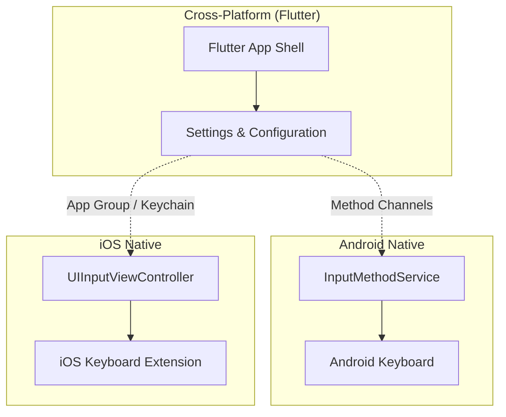

# Architecture Overview

This document outlines the high-level architecture of the AI Keyboard project.

## 1. System Overview

The AI Keyboard utilizes a three-layer architecture to provide a seamless cross-platform experience while leveraging native capabilities for the keyboard functionality:

*   **Flutter App Shell**: Serves as the main application interface for settings and configuration.
*   **Android Native Keyboard**: Implemented as a Kotlin `InputMethodService`.
*   **iOS Keyboard Extension**: Implemented as a Swift `UIInputViewController`.

## 2. Flutter Layer (`app/lib/`)

The Flutter application shell acts as the configuration hub for the keyboard and follows a feature-based clean architecture.

*   **Features**: `ai_service`, `settings`, `commands`, `playground`, `app_shell`
*   **Architecture Layers**: Each feature is separated into `data/`, `domain/`, and `presentation/` layers.
*   **State Management**: BLoC (`flutter_bloc`) is used for predictable state management.
*   **Dependency Injection**: Managed via `get_it` and `injectable` with code generation.
*   **Navigation**: Handled using `go_router`.
*   **Error Handling**: Uses a `Result` type (`Success`/`FailureResult`) for explicit error propagation.
*   **Models**: Data classes are immutable, generated using `Freezed`.

## 3. Android Native Layer (`app/android/`)

The Android keyboard is built using native Android SDKs for maximum performance and deep system integration.

*   **Core Components**: `KeyboardService` (extends `InputMethodService`) orchestrates the `KeyboardController`, which in turn manages the `KeyboardView`.
*   **AI Pipeline**: Uses an `AiProvider` interface. The `AiProviderFactory` instantiates the selected provider (Gemini, OpenAI, Groq, OpenRouter).
*   **Suggestion Engine**: `AospSuggestionEngine` bridges to the AOSP LatinIME via JNI for word suggestions.
*   **Secure Storage**: Uses `NativeSecureStorage` leveraging Android KeyStore (AES-256-GCM) for sensitive data.
*   **Media**: GIF support is provided by `GiphyGifProvider`.
*   **Voice Input**: Handled by `VoiceInputController` utilizing the native `SpeechRecognizer`.

## 4. iOS Layer (`app/ios/`)

The iOS keyboard extension is built natively using Swift.

*   **Core Component**: `KeyboardViewController` (extends `UIInputViewController`).
*   **AI Integration**: Implements the same four providers (Gemini, OpenAI, Groq, OpenRouter) using URLSession-based networking.
*   **Configuration Sharing**: Communicates with the Flutter app shell via App Group (`UserDefaults`) and the iOS Keychain.
*   **Limitations**: Note that there is currently no suggestion engine on the iOS platform.

## 5. Platform Communication

To bridge the gap between the Flutter app shell and native keyboard extensions:

*   **Android**: Uses Method Channels for credential management and settings sync.
*   **iOS**: Relies on App Group for sharing standard configuration and Keychain for secure credential sharing between the app and the keyboard extension.

## 6. AOSP Suggestion Engine

The Android text suggestion engine is based on the proven AOSP LatinIME.

*   **Core**: C/C++ native library compiled via CMake.
*   **Bridge**: JNI interface located in `latinime/`.
*   **Wrappers**: Kotlin wrappers exist in `suggestion/aosp/` to interact with the native code.
*   **Dictionary**: Uses a single English dictionary (`main_en.dict`).
