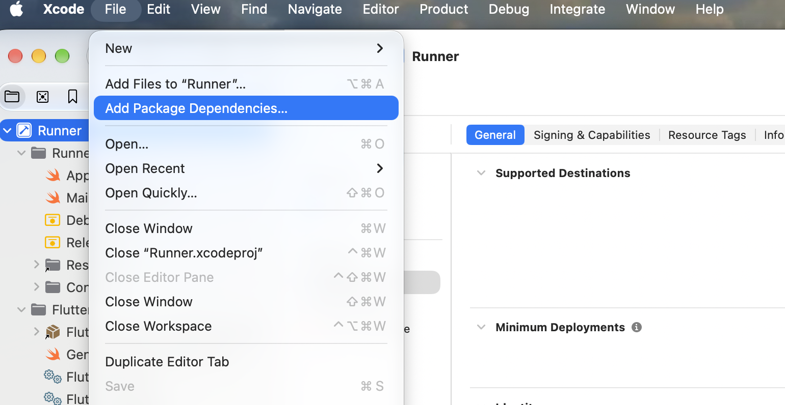
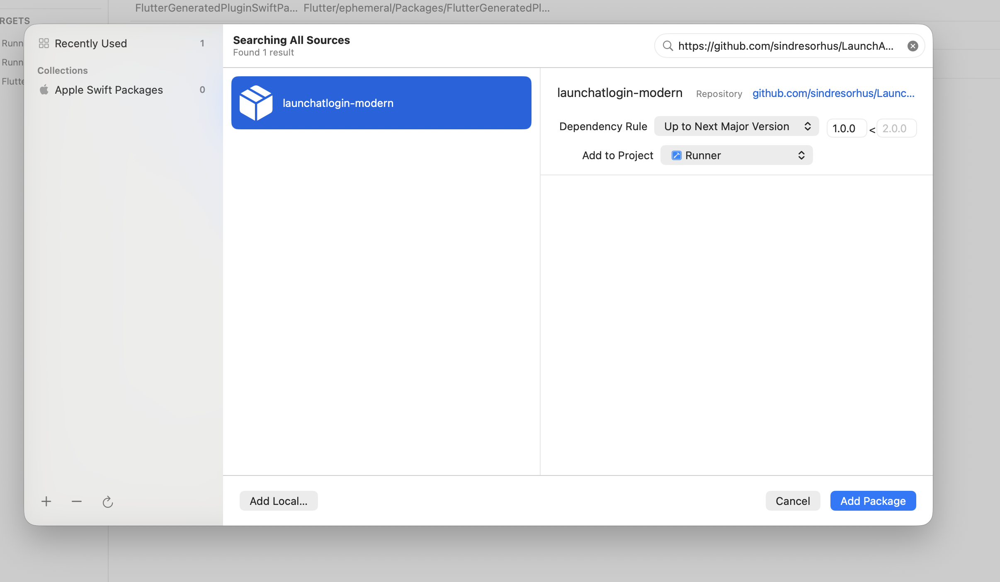
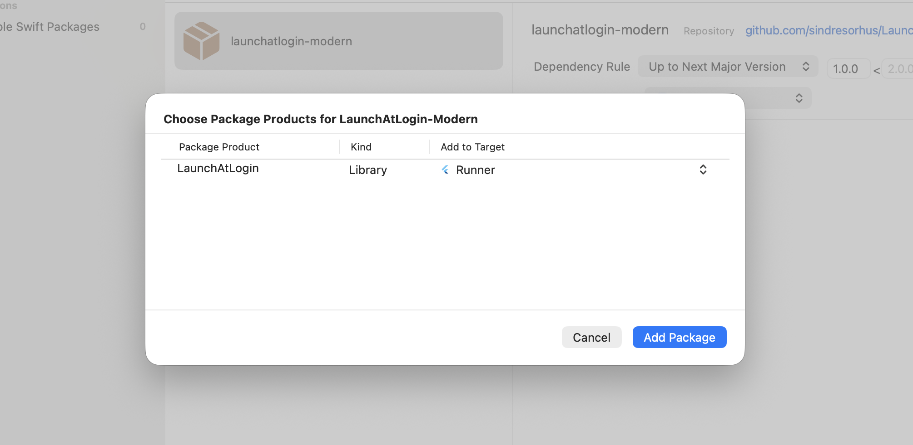

# open_at_login

A Flutter package for controlling whether a macOS Flutter application launches automatically when the user logs in.

`open_at_login` provides a straightforward Flutter API to query, enable, and disable launch-at-login behavior on macOS using Apple's modern Service Management login-item APIs via [LaunchAtLogin-Modern](https://github.com/sindresorhus/LaunchAtLogin-Modern).

---

## Features

- **Check status:** Inspect whether the application is currently registered to launch at login.
- **Enable launch at login:** Register the application to start automatically upon user login.
- **Disable launch at login:** Unregister the application from launching at login.
- **Modern macOS integration:** Uses Apple's modern macOS 13+ login-item mechanism via `LaunchAtLogin-Modern` (`SMAppService.mainApp`).
- **Cross-platform ready:** Single API for macOS and Windows.
- **Graceful no-op on other platforms:** Mobile, Linux, and Web safely no-op without requiring consumer platform checks.
- **Clean Flutter API:** Simple singleton interface communicating over a standard Flutter `MethodChannel`.

> **Platform Support:**
>
> - **macOS:** Fully supported via `LaunchAtLogin-Modern` (`SMAppService.mainApp`, macOS 13+).
> - **Windows:** Architecture slot prepared; native Windows support is planned/in progress.
> - **Other platforms (Linux, Android, iOS, Web):** Safely handled as graceful no-ops (`isEnabled()` returns `false`, `setEnabled(...)` does nothing). Consumers do not need platform guards.

---

## Requirements

- **Flutter SDK:** `>=1.17.0`
- **Dart SDK:** `^3.13.2`
- **macOS Deployment Target:** macOS 13.0 or later

---

## Installation

### Local / Path Dependency (Monorepo or In-Development)

Add `open_at_login` as a path dependency in your application's `pubspec.yaml`:

```yaml
dependencies:
  open_at_login:
    path: ../packages/open_at_login
```

### Pub.dev Dependency (When Published)

When published to pub.dev, add the package directly:

```yaml
dependencies:
  open_at_login: ^0.0.1
```

Then fetch dependencies:

```bash
flutter pub get
```

---

## macOS Native Setup

`open_at_login` communicates with macOS through the native Swift package [LaunchAtLogin-Modern](https://github.com/sindresorhus/LaunchAtLogin-Modern). Because this is a native Swift Package Manager (SPM) dependency, you must add it once to your macOS Xcode project.

Follow these three steps in Xcode:

### Step 1 — Add Package Dependencies

1. Open your Flutter project's `macos` folder in Xcode (or open `macos/Runner.xcworkspace`).
2. From the Xcode menu bar, select:

   **File → Add Package Dependencies...**



### Step 2 — Enter LaunchAtLogin-Modern URL

In the search or repository URL field in the top-right corner of the dialog, enter:

```text
https://github.com/sindresorhus/LaunchAtLogin-Modern
```



### Step 3 — Select Runner Target

When prompted to select package products and targets:

1. Select the **LaunchAtLogin** product.
2. Ensure it is added to the **Runner** target of your application.
3. Click **Add Package**.



---

## AppDelegate Setup

Your macOS Flutter application's `AppDelegate.swift` connects the Flutter package API to the native `LaunchAtLogin` implementation via a Flutter `MethodChannel`.

Open `macos/Runner/AppDelegate.swift` in your project and configure it as shown below:

```swift
import Cocoa
import FlutterMacOS
import LaunchAtLogin

@main
class AppDelegate: FlutterAppDelegate {

  override func applicationDidFinishLaunching(_ notification: Notification) {
    guard let controller = mainFlutterWindow?.contentViewController as? FlutterViewController else {
      return
    }

    // Set up the MethodChannel for open_at_login
    let channel = FlutterMethodChannel(
      name: "open_at_login",
      binaryMessenger: controller.engine.binaryMessenger
    )

    channel.setMethodCallHandler { call, result in
      switch call.method {
      case "isOpenAtLoginEnabled":
        // Queries whether launch-at-login is currently enabled
        result(LaunchAtLogin.isEnabled)

      case "setOpenAtLoginEnabled":
        // Enables or disables launch-at-login
        guard let arguments = call.arguments as? [String: Any],
              let enabled = arguments["enabled"] as? Bool else {
          result(
            FlutterError(
              code: "INVALID_ARGUMENT",
              message: "Expected 'enabled' as a Boolean.",
              details: nil
            )
          )
          return
        }

        LaunchAtLogin.isEnabled = enabled
        result(nil)

      default:
        result(FlutterMethodNotImplemented)
      }
    }

    super.applicationDidFinishLaunching(notification)
  }

  override func applicationShouldTerminateAfterLastWindowClosed(_ sender: NSApplication) -> Bool {
    return true
  }

  override func applicationSupportsSecureRestorableState(_ app: NSApplication) -> Bool {
    return true
  }
}
```

### MethodChannel Specification

- **Channel Name:** `open_at_login`
- **Method `isOpenAtLoginEnabled`:**
  - Invoked by `OpenAtLogin.instance.isEnabled()`.
  - Returns `Bool` representing `LaunchAtLogin.isEnabled`.
- **Method `setOpenAtLoginEnabled`:**
  - Invoked by `OpenAtLogin.instance.setEnabled(bool)`.
  - Accepts argument dictionary `{"enabled": bool}`.
  - Updates `LaunchAtLogin.isEnabled = enabled`.

---

## Flutter Usage

### 1. Import the Package

```dart
import 'package:open_at_login/open_at_login.dart';
```

### 2. Initialize the Instance

Call `initialize` before interacting with the launch-at-login API:

```dart
final openAtLogin = OpenAtLogin.instance;

openAtLogin.initialize(
  appName: 'My App',
  appPath: '/Applications/My App.app',
);
```

### 3. Check Current Status

```dart
final bool isEnabled = await openAtLogin.isEnabled();
print('Launch at login enabled: $isEnabled');
```

### 4. Enable or Disable Launch at Login

```dart
// Enable launch at login
await openAtLogin.setEnabled(true);

// Disable launch at login
await openAtLogin.setEnabled(false);
```

### Complete Example

```dart
import 'package:flutter/material.dart';
import 'package:open_at_login/open_at_login.dart';

void main() {
  WidgetsFlutterBinding.ensureInitialized();

  final openAtLogin = OpenAtLogin.instance;
  openAtLogin.initialize(
    appName: 'My App',
    appPath: '/Applications/My App.app',
  );

  runApp(const MyApp());
}

class MyApp extends StatefulWidget {
  const MyApp({super.key});

  @override
  State<MyApp> createState() => _MyAppState();
}

class _MyAppState extends State<MyApp> {
  final _openAtLogin = OpenAtLogin.instance;
  bool _isEnabled = false;
  bool _isLoading = true;

  @override
  void initState() {
    super.initState();
    _checkStatus();
  }

  Future<void> _checkStatus() async {
    final status = await _openAtLogin.isEnabled();
    setState(() {
      _isEnabled = status;
      _isLoading = false;
    });
  }

  Future<void> _toggle(bool value) async {
    setState(() => _isLoading = true);
    await _openAtLogin.setEnabled(value);
    await _checkStatus();
  }

  @override
  Widget build(BuildContext context) {
    return MaterialApp(
      home: Scaffold(
        appBar: AppBar(title: const Text('OpenAtLogin Demo')),
        body: Center(
          child: _isLoading
              ? const CircularProgressIndicator()
              : SwitchListTile(
                  title: const Text('Launch at Login'),
                  value: _isEnabled,
                  onChanged: (val) => _toggle(val),
                ),
        ),
      ),
    );
  }
}
```

---

## API Reference

### `OpenAtLogin.instance`

```dart
static final OpenAtLogin instance
```

The global singleton accessor for the `OpenAtLogin` manager.

### `OpenAtLogin.initialize`

```dart
void initialize({
  required String appName,
  required String appPath,
  List<String> args = const [],
})
```

- **Purpose:** Prepares the platform implementation. Should be called once during app startup.
- **Parameters:**
  - `appName`: Display name of the application.
  - `appPath`: Executable or bundle path of the application.
  - `args`: Optional arguments list passed when launched at login.
- **Return Type:** `void`
- **Behavior:** On macOS, initializes the macOS launcher implementation. On Windows, initializes the Windows launcher slot. On other platforms, safely no-ops without throwing exceptions.

### `OpenAtLogin.isEnabled`

```dart
Future<bool> isEnabled()
```

- **Purpose:** Checks whether the application is currently registered to launch at login.
- **Parameters:** None.
- **Return Type:** `Future<bool>`
- **Behavior:** Returns `true` if enabled, `false` otherwise. Returns `false` safely on unsupported platforms or if called prior to `initialize()`. Propagates `PlatformException` if a supported platform encounters a native failure.

### `OpenAtLogin.setEnabled`

```dart
Future<void> setEnabled(bool enabled)
```

- **Purpose:** Enables or disables launch at login.
- **Parameters:**
  - `enabled`: `true` to register the application at login, `false` to unregister.
- **Return Type:** `Future<void>`
- **Behavior:** Sets the launch at login state on supported platforms. Safely no-ops on unsupported platforms or if called prior to `initialize()`. Propagates `PlatformException` if a supported platform encounters a native failure.

---

## Important macOS Note

`LaunchAtLogin-Modern` is a native Swift package dependency that communicates with macOS Service Management. The architecture follows this pipeline:

```text
Flutter package (open_at_login)
    ↓
MethodChannel ("open_at_login")
    ↓
AppDelegate.swift
    ↓
LaunchAtLogin (Swift Package)
    ↓
macOS Login Items (SMAppService.mainApp)
```

Because `open_at_login` communicates across this channel, the native Swift Package Manager dependency must be added directly to the consuming application's `Runner` target in Xcode.

---

## macOS Version Compatibility

- **Supported:** **macOS 13.0 or later**

`LaunchAtLogin-Modern` utilizes Apple's modern `SMAppService.mainApp` API introduced in macOS 13 (Ventura). It is designed specifically for macOS 13+ and does not support macOS 12 or earlier.

---

## Troubleshooting

### Launch at Login does not work

Verify the following items:

1. **SPM Dependency Added:** Confirm `LaunchAtLogin-Modern` (`https://github.com/sindresorhus/LaunchAtLogin-Modern`) is present under **Package Dependencies** in your Xcode project.
2. **Target Assignment:** Confirm `LaunchAtLogin` is linked against the **Runner** target in Xcode (**Runner target → General → Frameworks, Libraries, and Embedded Content**).
3. **AppDelegate Imports:** Ensure `import LaunchAtLogin` is present at the top of `macos/Runner/AppDelegate.swift`.
4. **Channel Name:** Verify the MethodChannel identifier in `AppDelegate.swift` is exactly `"open_at_login"`.
5. **Method Names:** Ensure the handled methods match `"isOpenAtLoginEnabled"` and `"setOpenAtLoginEnabled"`.
6. **macOS Version:** Verify the Mac running the application is on **macOS 13.0 or later**.

---

## Example Project

A complete working example application is provided in the repository:

```text
packages/open_at_login/example
```

It demonstrates initialization, status checking, and toggling the launch-at-login state within a Flutter macOS application.

---

## License & Repository

- **Repository:** [https://github.com/pavan-marthala/ai_keyboard.git/packages/open_at_login](https://github.com/pavan-marthala/ai_keyboard.git/packages/open_at_login)
- **License:** Refer to the [`LICENSE`](LICENSE) file in the root of the package.
